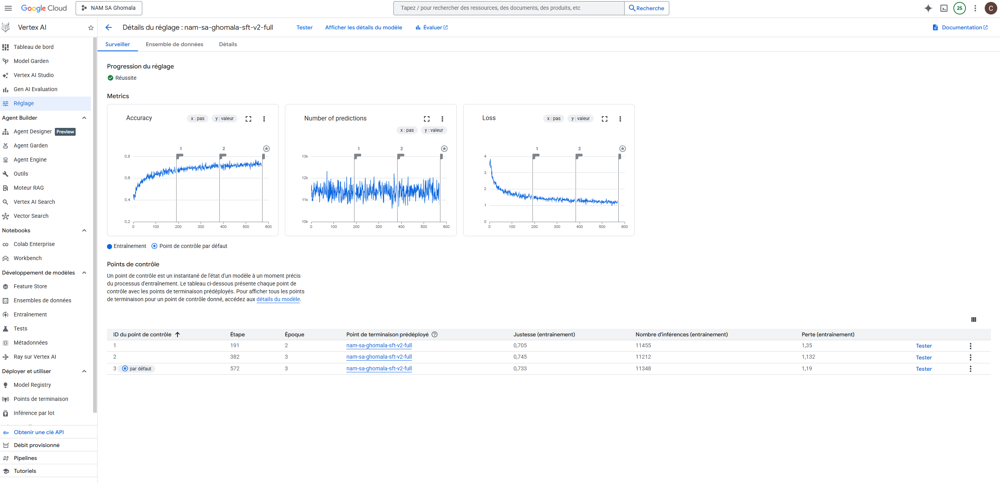
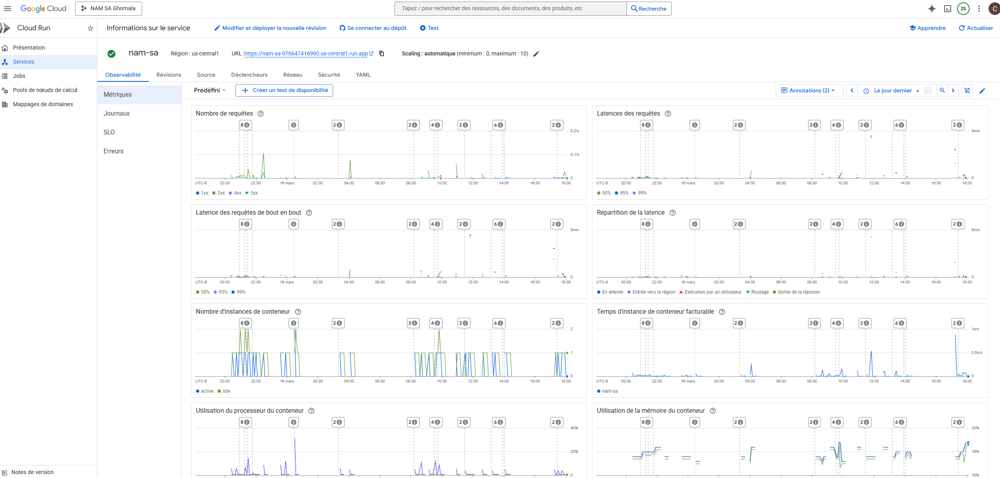

# NAM SA' — Le Soleil S'est Levé ☀️

> **AI-powered live voice agent for preserving the Ghomala' language — Google ADK, Gemini Live API, Vertex AI SFT & Chirp 3 HD TTS**

[](#) [](#) [](#) [](#) [](#)

An elder-like AI tutor that teaches and preserves **Ghomala' (Ghɔ́málá')**, a Bamiléké tonal language spoken by ~1 million people in western Cameroon. NAM SA' supports **real-time voice conversations**, text translation, vocabulary learning, proverbs with cultural context, and high-fidelity pronunciation — powered by Google's Agent Development Kit (ADK), Gemini models fine-tuned on 54,000+ Ghomala' samples, and **Chirp 3 HD** for tonal speech synthesis.

---

## 🎯 The Problem

**Ghomala' is dying.** Like 40% of the world's ~7,000 languages, it faces extinction as younger generations shift to French and English. There is:
- No mainstream AI that speaks or understands Ghomala'
- No TTS model that handles its tonal diacritics (ɔ̀, ɛ́, ŋ, ə, ʉ)
- Very limited digital educational resources
- A rich oral tradition (proverbs, cultural knowledge) at risk of being lost

NAM SA' addresses this by building the **first AI voice agent** capable of teaching, translating, and conversing in Ghomala' — using the latest Google AI/Cloud technologies.

---

## 📱 App Features (6 Screens)

| Screen | Description |
|--------|-------------|
| **🏠 Home** | Landing page with 4 mode cards, voice CTA, quick phrases |
| **🎙️ Live Voice** | Real-time tap-to-talk voice conversation via WebSocket + Gemini Live API (ADK native audio streaming, auto turn detection) |
| **💬 Chat** | Text-based conversation with the AI tutor |
| **📖 Tuteur** | Structured vocabulary learning: 3 levels × 5 topics × ~5 words per topic, with on-demand Ghomala' translation & TTS |
| **🌿 Proverbes** | Bamiléké proverbs with cultural explanations, Ghomala' TTS pronunciation |
| **🔄 Dictionnaire** | Google Translate-style interface: FR ↔ Ghomala' ↔ EN, with bi-directional TTS |

---

## 🏗️ Repository Structure

```
nam-sa-google/
├── backend/                           # 🖥️ FastAPI + ADK Agent (Cloud Run)
│   ├── nam_sa_agent/                  #   Google ADK agent package
│   │   ├── agent.py                   #     Root agent + 3 tools (dictionary, pronunciation, culture)
│   │   └── .env                       #     Environment config
│   ├── src/
│   │   └── main.py                    #   FastAPI server (REST + WebSocket endpoints)
│   ├── Dockerfile                     #   Python 3.11, uvicorn on port 8080
│   └── requirements.txt
│
├── mobile/                            # 📱 React Native / Expo SDK 55 app
│   ├── App.js                         #   Navigation (6 screens)
│   ├── src/
│   │   ├── screens/                   #   HomeScreen, LiveScreen, DialogueScreen,
│   │   │                              #   DictionaryScreen, TutorScreen, ProverbsScreen
│   │   ├── services/
│   │   │   ├── api.js                 #   REST + WebSocket client
│   │   │   └── tts.js                 #   Shared TTS helper (Chirp 3 HD via backend)
│   │   ├── context/
│   │   │   └── LanguageContext.js     #   i18n (FR/EN) with React Context
│   │   ├── data/
│   │   │   └── vocabulary.js          #   Tutor mode vocabulary data
│   │   └── theme/
│   │       └── index.js               #   Cultural design system (maroon, gold, green)
│   └── package.json                   #   Expo 55, React Native 0.83
│
├── data/                              # 📊 Dataset & fine-tuning pipeline
│   ├── scripts/
│   │   ├── 00_extract_dictionary_from_pdf.py  # OCR extraction from Ghomala' PDF dictionary
│   │   ├── 01_download_datasets.py            # Download Masakhane/HuggingFace datasets
│   │   ├── 02_transform_to_jsonl.py           # Convert to Vertex AI SFT JSONL
│   │   ├── 02_2_validate_jsonl.py             # Validate JSONL structure
│   │   ├── 03_upload_to_s3.py                 # Upload to GCS bucket
│   │   └── 04_launch_fine_tuning.py           # Launch SFT on Vertex AI
│   ├── dictionary/
│   │   └── ghomala_dictionary.json    #   4,929 curated entries (extracted from PDF)
│   ├── processed/                     #   train.jsonl + val.jsonl
│   └── raw/                           #   Raw datasets
│
├── docs/                              # 📚 Documentation
│   └── fine-tuning/
│       ├── iam_setup.md               #   GCP IAM & permissions
│       └── SFT_vs_RFT_explained.md    #   SFT strategy explained
│
├── deploy.sh                          # 🚀 One-command automated Cloud Run deployment
├── cloudbuild.yaml                    # 🔄 CI/CD pipeline (Cloud Build → Cloud Run)
└── requirements.txt                   # Data pipeline dependencies
```

---

## ⚙️ Architecture

```
┌─────────────────┐         ┌───────────────────────┐        ┌──────────────────────────────┐
│   Mobile App    │──REST──►│                       │──────►│  Gemini 2.5 Flash SFT v2      │
│   (Expo SDK 55) │         │   FastAPI on           │        │  54,325 samples fine-tuned    │
│                 │──WS────►│   Cloud Run            │        │  Text chat & translation      │
│   6 screens     │◄═══════►│   (1Gi / 2 vCPU)      │        └──────────────────────────────┘
│   Push-to-talk  │  audio  │                       │        ┌──────────────────────────────┐
│   + text chat   │  + text │   ADK Runner           │◄══════►│  Gemini Live API (ADK)        │
└─────────────────┘         │   run_live()           │  bidi  │  Native audio streaming       │
                            │                       │        │  + automatic tool calling     │
                            │                       │        └──────────────────────────────┘
                            │                       │        ┌──────────────────────────────┐
                            │                       │──────►│  Chirp 3 HD TTS               │
                            │                       │        │  Tonal diacritics support     │
                            │                       │        │  SSML prosody for Ghomala'    │
                            └───────────────────────┘        └──────────────────────────────┘
                                      │
                      ┌───────────────┼───────────────┐
                      │               │               │
              ┌───────▼──────┐ ┌─────▼──────┐ ┌──────▼──────┐
              │  ADK Agent   │ │  4,929      │ │  GCS        │
              │  3 tools     │ │  Dictionary │ │  Training   │
              │  (dict/pron/ │ │  entries    │ │  data       │
              │   culture)   │ │  (JSON)     │ │  (JSONL)    │
              └──────────────┘ └────────────┘ └─────────────┘
```

### Voice Pipeline (Live API — Bidirectional Streaming)

1. **LiveScreen (Mobile)**: Tap-to-talk → records audio (16kHz mono AAC/M4A) → reads as base64
2. **WebSocket `/ws/live`**: Sends audio to FastAPI backend via WebSocket
3. **PCM Conversion**: Backend converts M4A/AAC → raw PCM 16kHz mono 16-bit (via pydub + ffmpeg)
4. **ADK `Runner.run_live()`**: Feeds PCM to `LiveRequestQueue` → Gemini Live API (native audio model)
5. **Gemini Live API**: Processes speech bidirectionally — handles turn detection, tool calling (dictionary, SFT model), and generates audio response
6. **Response**: PCM audio converted to WAV + text transcript sent back to mobile simultaneously
7. **Auto-restart**: Client plays WAV response, then automatically resumes recording for continuous conversation

### Key Services

| Service | Role |
|---------|------|
| **Google ADK** | Agent framework — `Runner.run_live()` + `LiveRequestQueue` for bidirectional audio streaming with automatic tool calling |
| **Gemini Live API** | Real-time speech-to-speech (native audio model) via ADK toolkit |
| **Gemini 2.5 Flash (SFT v2)** | Fine-tuned text model — 54,325 Ghomala' samples on Vertex AI |
| **Chirp 3 HD** | Latest Google TTS — multilingual, tonal diacritics, SSML support |
| **Cloud Run** | Managed containers, WebSocket support, auto-scaling |
| **Cloud Build** | CI/CD — automated Docker build + deploy pipeline |

---

## 🚀 Automated Cloud Deployment

> **Bonus: Infrastructure-as-Code** — Automated deployment with `deploy.sh` and `cloudbuild.yaml`

### Option A: One-Command Deploy (`deploy.sh`)

```bash
# Deploy everything with a single command
./deploy.sh nam-sa-ghomala
```

The script automatically:
1. Enables required GCP APIs (`run`, `cloudbuild`, `aiplatform`)
2. Copies dictionary data into the backend build context
3. Builds the Docker image via Cloud Build
4. Deploys to Cloud Run with all environment variables pre-configured
5. Outputs the live service URL

### Option B: CI/CD Pipeline (`cloudbuild.yaml`)

```bash
# Trigger Cloud Build pipeline
gcloud builds submit --config cloudbuild.yaml --project=nam-sa-ghomala
```

The `cloudbuild.yaml` pipeline:
1. Prepares dictionary data in the build context
2. Builds a Docker image (`Python 3.11 + uvicorn + ADK`)
3. Pushes to Artifact Registry
4. Deploys to Cloud Run (1Gi RAM, 2 vCPU, 300s timeout)
5. Configures all Vertex AI environment variables automatically

Both scripts are idempotent and handle the full lifecycle from source to production.

---

## 🧠 Fine-Tuning Pipeline

### Data Sources

| Source | Records | Description |
|--------|---------|-------------|
| Ghomala' PDF Dictionary (OCR) | 4,929 | Extracted from physical dictionary using Python PDF extraction |
| Masakhane fr↔bbj | ~15,000 | Community-contributed FR-Ghomala' translations |
| French-Ghomala' Bandjoun | ~35,000 | Curated bilingual dataset |
| **Total SFT v2** | **54,325** | Combined, deduplicated, validated |

### Training

| Version | Samples | Base Model | Job ID | Status |
|---------|---------|------------|--------|--------|
| SFT v1 | ~20,000 | `gemini-2.5-flash-001` | `936727952031219712` | ✅ Completed |
| **SFT v2** | **54,325** | `gemini-2.5-flash-001` | Latest | ✅ **In Production** |

**Endpoint:** `projects/976647416990/locations/us-central1/endpoints/3643166357693923328`

### Pipeline Commands

```bash
cd data/scripts

# 1. Extract dictionary from PDF
python 00_extract_dictionary_from_pdf.py

# 2. Download Masakhane + community datasets
python 01_download_datasets.py

# 3. Transform to Vertex AI SFT JSONL format
python 02_transform_to_jsonl.py --no-limit     # → 54,325 samples

# 4. Validate JSONL structure
python 02_2_validate_jsonl.py

# 5. Upload to GCS
python 03_upload_to_gcs.py

# 6. Launch SFT fine-tuning on Vertex AI
python 04_launch_fine_tuning.py --mode sft
```

---

## 🔊 Text-to-Speech: Chirp 3 HD

NAM SA' uses **Google Cloud Chirp 3 HD** — Google's latest and most advanced TTS model — chosen specifically for its superior handling of Unicode diacritics and tonal markers essential to Ghomala'.

| Feature | Neural2 (before) | Chirp 3 HD (now) |
|---------|-------------------|-------------------|
| Unicode diacritics (ɔ̀, ɛ́, ŋ) | ❌ Poor, reads letter-by-letter | ✅ Natural phonetic rendering |
| Tonal markers (à, á, â, ǎ) | ❌ Ignored | ✅ Modulates pitch |
| SSML prosody support | Basic | ✅ Full (`<prosody rate="slow">`) |
| Voice quality | Robotic | Natural, expressive |
| Multilingual | Per-language only | ✅ Cross-lingual in same voice |

**Voice:** `fr-FR-Chirp3-HD-Aoede` (female, warm tone — chosen for elder-like teaching persona)

For Ghomala' text, the backend wraps content in SSML with slow prosody to respect the tonal cadence:
```xml
<speak>
  <prosody rate="slow" pitch="+0st">
    Mə̀ bɔ̀ á!
  </prosody>
</speak>
```

---

## 🏔️ Challenges & Difficulties

This section documents the real technical journey of building NAM SA' — every breakthrough and every wall we hit. These are the stories behind the code.

### Challenge 1: The Expo SDK 55 Breaking Change

**Problem:** After upgrading to Expo SDK 55, all TTS audio and voice recording silently broke. The app showed no explicit error on some paths, and on others: `Cannot read property 'Base64' of undefined`.

**Root Cause:** Expo SDK 55 completely rewrote `expo-file-system`. The default import (`require('expo-file-system')`) now returns a **new File/Directory class API** that does NOT include `writeAsStringAsync`, `readAsStringAsync`, `EncodingType`, or `cacheDirectory`. The legacy API was moved to a subpath.

**Impact:** 
- TTS playback broken on ALL screens (Dictionary, Tutor, Proverbs, Live)
- WebSocket voice conversation appeared to "not respond" — but the real issue was the client crashing before sending audio
- Cloud Run logs showed clean WebSocket connects/disconnects with zero audio data received

**Fix:** Changed all 3 occurrences across 2 files:
```js
// Before (broken in SDK 55)
const FileSystem = require('expo-file-system');

// After (works)
const FileSystem = require('expo-file-system/legacy');
```

**Lesson:** Breaking changes in Expo native modules can silently kill features without throwing visible errors to the user. Always check subpath exports after major SDK upgrades.

### Challenge 2: The Wrong Endpoint ID (A Single Character)

**Problem:** After deploying SFT v2, all translations returned `"Erreur de réponse"`. The backend logs showed HTTP 200 on the Vertex AI call — but the response was garbage.

**Root Cause:** The Cloud Run environment variable `GEMINI_TUNED_MODEL` pointed to endpoint `...19328` instead of `...23328`. **One wrong digit** in a 19-character endpoint ID.

**Fix:** 
```bash
gcloud run services update nam-sa \
  --update-env-vars "GEMINI_TUNED_MODEL=projects/976647416990/locations/us-central1/endpoints/3643166357693923328"
```

**Lesson:** Infrastructure debugging requires end-to-end verification. An HTTP 200 doesn't mean the right model answered.

### Challenge 3: 429 Rate Limiting Kills the Tutor

**Problem:** In Tutor mode, word cards showed `"..."` permanently for some words. Users couldn't retry — the error was cached forever.

**Root Cause:** A cascade:
1. User opens a vocabulary topic → 5-7 words need translation simultaneously
2. Each word fires an independent `/api/translate` call to Vertex AI
3. The SFT endpoint has rate limits → some calls return `429 RESOURCE_EXHAUSTED`
4. The mobile `catch` block cached `'...'` permanently: `setGhomalaCache({ [key]: '...' })`
5. Since `'...'` is truthy, the word could never be retranslated

**Fix (multi-layered):**
- **Backend:** Added retry with exponential backoff (3 attempts, 1.5s/3s delays) on 429 errors
- **Backend:** Returns HTTP 429 (not 500) after exhausting retries — so the client knows it's transient
- **Mobile:** Failed translations now use `'…'` (Unicode ellipsis) and are **retryable on tap**

### Challenge 4: The Model That Explains Instead of Translating

**Problem:** When translating phrases (not single words), the fine-tuned model returned explanations like *"The provided dictionary does not contain this phrase"* instead of translating.

**Root Cause:** The dictionary enrichment context confused the model. When no dictionary match was found for a phrase, the model interpreted the system instruction as "only use dictionary" and refused to translate.

**Fix:** Rewrote the translate system instruction to be absolute:
```
"RÈGLE ABSOLUE: Réponds UNIQUEMENT avec la traduction.
JAMAIS d'explication. Si tu ne connais pas la traduction exacte,
donne ta meilleure approximation phonétique."
```
Added post-processing to detect and clean hallucinated explanations from the response.

### Challenge 5: TTS Pronunciation — From Robotic to Natural

**Problem:** The TTS read Ghomala' words robotically, letter-by-letter, ignoring tonal diacritics. Words like `ghɔ̀'tɔ̀` sounded nothing like real Ghomala'.

**Root Cause:** Google Cloud **Neural2** voices are not designed for tonal African languages. They treat Unicode diacritics as decoration, not phonetic instructions.

**Fix:** Upgraded to **Chirp 3 HD** (`fr-FR-Chirp3-HD-Aoede`):
- Chirp 3 is Google's latest multilingual TTS model
- It handles Unicode combining characters (tone marks, special vowels)
- Added SSML wrapping with `<prosody rate="slow">` for Ghomala' text
- Removed the artificial `speaking_rate: 0.85` that made French sound unnatural

### Challenge 6: AWS→Google Cloud Migration Mid-Hackathon

**Problem:** The project initially started on AWS (Lambda, API Gateway, Bedrock). Mid-hackathon, we realized the Google Live Agent Challenge **requires** Google Cloud infrastructure.

**Impact:** Complete backend rewrite:
- AWS Lambda + API Gateway → **Cloud Run + FastAPI**
- AWS Bedrock (Nova Lite 2) → **Vertex AI + Gemini 2.5 Flash**
- Custom WebSocket handler → **Google ADK** (`Runner.run_live()`)
- AWS Polly → **Google Cloud TTS** (Neural2 → Chirp 3 HD)
- S3 → **GCS** for training data
- CloudWatch → **Cloud Run Logs** for debugging

**Lesson:** Read hackathon rules before writing code. But the migration forced us to learn ADK, which turned out to be a better architecture.

### Challenge 7: Building a Dictionary from a Physical Book

**Problem:** The most authoritative Ghomala'-French dictionary exists only as a **scanned PDF** — not in any digital database.

**Solution:** Script `00_extract_dictionary_from_pdf.py` extracts structured data from the PDF:
- OCR parsing of complex formatting (Ghomala' entry + French definitions + grammatical categories)
- Handling of Unicode characters (ɔ, ɛ, ŋ, ə, subscript numbers)
- Output: 4,929 structured JSON entries used for both fine-tuning and real-time dictionary lookup

### Challenge 8: SFT v1 → v2 (20K → 54K Samples)

**Problem:** SFT v1 (20,000 samples) produced a model that knew basic vocabulary but struggled with phrases, proverbs, and cultural context.

**Solution:** SFT v2 combined all available sources:
- Masakhane community translations (~15K)
- French-Ghomala' Bandjoun dataset (~35K)
- Dictionary-derived training pairs (~4K)
- **Total: 54,325 validated samples** — nearly 3× the v1 dataset

The improvement was immediate: phrase translations, cultural context, and proverb explanations all dramatically improved.

---

## 🚀 Quick Start

### 1. Deploy Backend (One Command)

```bash
# Clone and deploy
git clone https://github.com/YOUR_USERNAME/nam-sa-google.git
cd nam-sa-google

# Deploy to Cloud Run (automated)
./deploy.sh YOUR_PROJECT_ID
```

### 2. Run Mobile App

```bash
cd mobile
npm install
npx expo start
```

### 3. Fine-Tune Your Own Model

```bash
pip install -r requirements.txt
cd data/scripts
python 01_download_datasets.py
python 02_transform_to_jsonl.py --no-limit
python 03_upload_to_gcs.py
python 04_launch_fine_tuning.py --mode sft
```

---

## 📡 API Endpoints

| Method | Path | Description |
|--------|------|-------------|
| `GET` | `/health` | Health check + model info |
| `POST` | `/api/chat` | Text conversation (SFT v2) |
| `POST` | `/api/translate` | Translation FR ↔ Ghomala' ↔ EN (dictionary-first, model fallback, retry on 429) |
| `POST` | `/api/tts` | TTS synthesis via Chirp 3 HD (SSML for Ghomala') |
| `WS` | `/ws/live` | **Primary voice endpoint** — ADK `Runner.run_live()` + Gemini Live API native audio streaming with automatic tool calling |
| `WS` | `/ws/voice` | Legacy bidirectional audio streaming endpoint |

---

## 📋 Hackathon

- **Competition:** Google Cloud — Live Agent Challenge
- **Category:** Live Agents 🗣️
- **Requirements:** Gemini Live API or ADK, hosted on Google Cloud
- **Automated Deployment:** `deploy.sh` + `cloudbuild.yaml` (Infrastructure-as-Code)

### ☁️ Cloud Run Deployment Proof




### 📲 Download the APK

> **[Download NAM SA' APK (Android)](https://expo.dev/accounts/theparadoxe/projects/nam-sa/builds/780577a8-0bd9-42bc-86a8-12a9bcb2c815)**

Install on any Android device to test the live voice agent.

## 🙏 Acknowledgments

- **Masakhane** community for Ghomala' NLP datasets
- The Bamiléké elders whose language wisdom we are preserving
- Google ADK, Gemini, and Vertex AI teams

## 📜 License
MIT
